# Title
## CNN을 이용한 음식 이미지 분류 및 실사용 예제

# Quick Start
```python
# train
python main.py --mode=train --model_type=resnet
```
```python
# test
python main.py --mode=test --ckpt={ckpt_path}
```
```python
# visualization
pythom main.py --mode=visualization --ckpt={ckpt_path}
```
```python
# inference (single image)
python inference.py --ckpt={ckpt_path} --img={image_path}
```

# 목차 Contents

- [Members](#Members)
- I. [Proposal](#i-proposal)
- II. [Datasets](#ii-datasets)
- III. [Methodology](#iii-methodology)
- IV. [Evaluation & Analysis](#iv-evaluation--analysis)
- V. [Conclusion-Discussion](#v-conclusion-discussion)
- VI. [Related Works & References](#vi-related-works--references)

# Members
### 김도현:  데이터사이언스학부/ 모델 훈련 및 주요 코드 작성/ dhkim011030@gmail.com
### 김준환:  융합전자공학부/ git-hub관리 및 보고서 작성/ junsemin@naver.com
### 심준용:  수학과/ 데이터 셋 선정 및 분석(조장)/ wnsdyd029451@gmail.com
### 안성우:  융합전자공학부/ 발표 영상 촬영/ tjddn00124@gmail.com

# I. Proposal

### Motivation: Why are you doing this?
우리는 인공지능 기술의 발전을 통해 다양한 실생활 문제를 해결하려고 하고 있다. 요즘 SNS의 발달과 코로나 시기로 인하여 운동과 건강관리에 대한 욕구가 점점 증가하고 있어 자연스럽게 식단관리에 대한 관심이 증가하고 있다. 따라서 우리는 이러한 사람들의 이슈를 돕는 딥러닝 시스템이 있으면 좋을 것 같다고 생각을 하여 음식 이미지 분류에 대한 프로젝트를 진행하게 되었다.

 또한 이는 단순한 식단관리를 넘어 레스토랑, 건강관리, 요리 레시피 추천 등 여러 분야에서 도움을 줄 수 있고, 인공지능이 얼마나 정확하게 음식 이미지를 분류할 수 있는지를 확인함으로써 인공지능의 역할과 기능에 대해서 깊은 학습을 할 수 있는 프로젝트라고 생각하였다.


### What do you want to see at the end?
우선, 음식 이미지 분류를 다양한 deep learning 모델(ResNet50[[5]](#논문paper), AlexNet[[6]](#논문paper), VGG[[7]](#논문paper))을 활용하여 성능비교(Accuracy, Error Rate 등)를 해보고, 최적의 모델을 찾아보려고 한다. 그 뒤, 해당 모델을 이용하여 본격적으로 이미지 분류 학습을 하고 CNN Filter Visualization[[8]](#논문paper) 분석, T-SNE Feature Embedding Visulaization[[9]](#논문paper) 분석, CAM(Class Activation Map)[[10]](#논문paper)분석을 통하여 가중치를 시각화 하고 어떤 가중치들이 분류에 있어서 주요했는지를 분석하고자 한다. 이를 통해서 음식 이미지 분류에 있어서 key가 되는 부분을 확인하여 궁극적으로 성능 개선을 통해 실생활에서도 오류없이 적용가능한 모델로 발전시킬 수 있는 지를 분석해본다.

# II. Datasets
### Describing your dataset
https://www.kaggle.com/datasets/harishkumardatalab/food-image-classification-dataset

kaggle의 Food Image Classification Dataset[[1]](#블로그blog)을 이용하였다. 24k개의 이미지들로 이루어져 있으며, 사진과 같이 34개 종류의 다양한 나라의 음식들으로 이루어져 있다.

### CLASS 
> Icecream, Burger, Butter Naan, Taquito, Paani Puri, Fries, Hot Dog, Chapati, Dhokla, Kulfi, Pav Bhaji, Crispy Chicken, Donut, Fried Rice, Pizza, Jalebi, Chicken Curry, Taco, Pakode, Dal Makhani, Cheesecake, Sushi, Idli, Kadai Paneer, Chole Bhature, Kaathi Rolls, Baked Potato, Momos, Samosa, Sandwich, Apple Pie, Masala Dosa, Omelette, Chai


<center>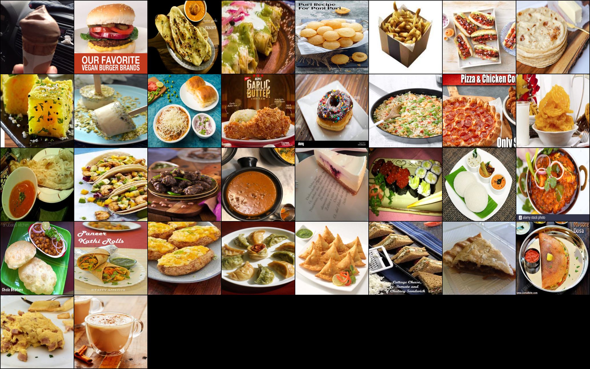</center>  <br>

그리고 데이터 세트의 각 클래스 분포는 다음과 같다.

<center>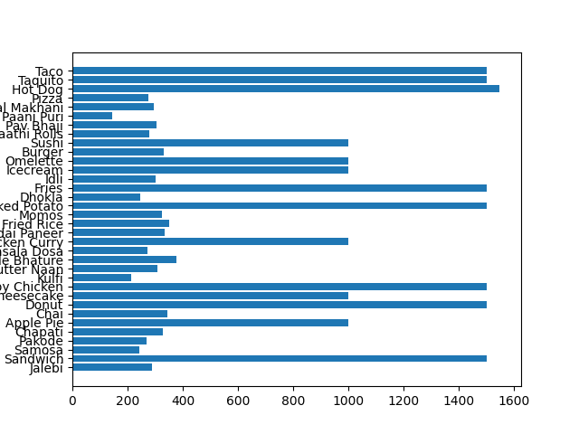</center> <br>

또한, 추가로 각자 실제 음식 사진을 찍어서 테스트 함으로써 실제 사용자가 사진을 찍었을 때의 결과도 같이 평가 하였다. 다음은 우리가 찍은 실제 사진이다.

<center>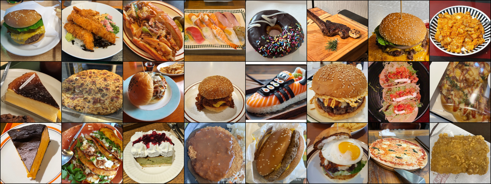</center>  <br>

해당 데이터셋을 훈련, 검증, 테스트 세트로 나누는 것은 하이퍼 파라미터를 조정하여 모델의 성능을 효과적으로 평가하고 과적합을 방지하기 위한 중요한 단계이다. 이에 따른 우리의 훈련, 검증, 테스트 세트에 대한 분포는 다음과 같다.

훈련 세트(Train Set):70%

검증 세트(Validation Set): 15%

테스트 세트(Test Set): 15%

# III. Methodology
### Explaining your choice of algorithms (methods)
- 데이터 증강(Data Augmentation) <br>

<center>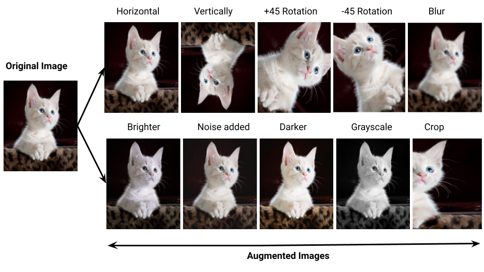</center> <br>

> 데이터 증강[[4]](#블로그blog)은 모델의 일반화 성능을 향상시키기 위해 기존의 데이터 세트를 회전, 이동, 스케일링, 플리핑 등 인위적으로 증가시키는 기법이다. 이를 통해 과적합(Overfitting)을 방지하고, 데이터의 다양성도 증가시켜 더 우수한 모델로 학습시킬 수 있게 한다.

- VGG, AlexNet, ResNet Model Comparison

## 비교 모델

**AlexNet**

<center>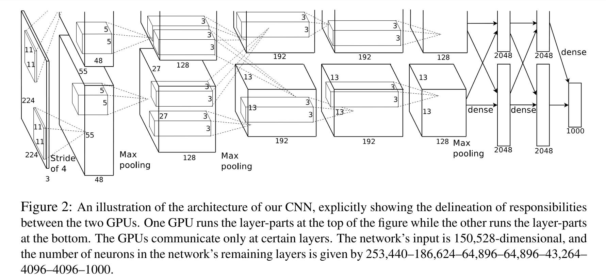</center> <br>

> AlexNet[[6]](#논문paper)은  심층 신경망 모델로, 딥러닝 분야에서 중요한 전환점을 마련했다. AlexNet은 이미지 분류 작업에서 탁월한 성능을 보여주며, 그 이후의 딥러닝 연구에 큰 영향을 미쳤다 신경망 구조, ReLU활성화 함수, 드롭아웃, 데이터 증강, 그리고 GPU 병렬처리를 통해 성능을 극대화했다.

**VGG**

<center>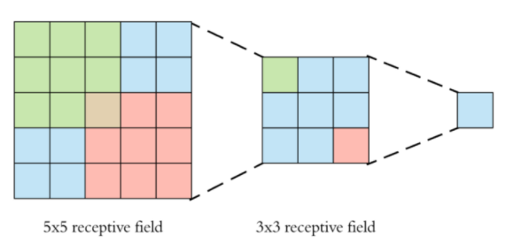</center> <br>

> VGG(Visual Geometry Group)[[7]](#논문paper)는 대규모 이미지 인식을 위한 매우 깊은 컨볼루션 네트워크이다. 16 혹은 19개의 레이어를 이용하고, 큰 커널 크기 필터를 여러 3X3 커널 크기 필터로 차례로 교체하여 AlexNet에 비해 상당한 개선을 이루었다[[2]](#블로그blog).

**ResNet**

<center>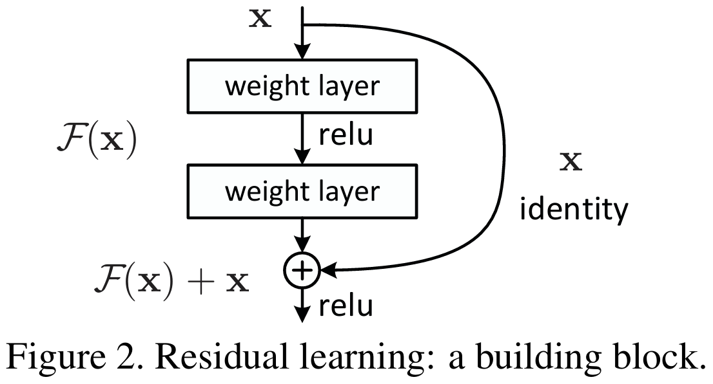</center> <br>

> ResNet(Residual Networks)[[5]](#논문paper)은 딥러닝 모델의 깊이를 증가시키면서도 학습이 가능하도록 설계된 모델로, '잔차학습'(Residual Learning)이라는 개념을 도입해 매우 깊은 네트워크에서도 효과적으로 학습할 수 있도록 하였다. ResNet은 성능이 매우 뛰어나며, 기울기 소실(Gradient Vanishing)문제를 효과적으로 해결하여 복잡한 문제를 해결할 수 있는 능력을 제공하고 이를 통해 이미지 분류, 객체 탐지 등 다양한 컴퓨터 비전 과제에서 높은 성능을 발휘한다.

우리는 실험 결과 세 개의 모델 중 성능이 더 좋았던 이 ResNet50을 채택하였다. (여기서 50은 layer층의 개수를 말한다.)

## 시각화 기법

- CNN Filter Visualization

<center>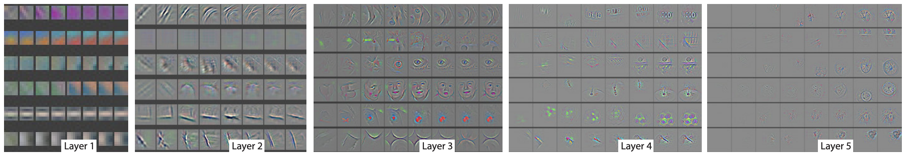</center> <br>

> CNN 필터 시각화(CNN Filter Visulaization)[[8]](#논문paper)는 컨볼루션 신경망(CNN)의 내부 작동 방식을 이해하고, 모델이 입력 이미지에서 어떤 특징을 학습하는지 분석하는 데 사용된다. CNN의 필터는 이미지의 특정 패턴이나 특징을 감지하는 역할을 하며, 필터 시각화는 이러한 과정이 어떻게 이루어지는지 시각적으로 보여주어서 이는 모델의 성능을 개선하거나, 예기치 않은 결과를 설명하는 데 유용한 정보를 제공할 수 있다.

- T-SNE Feature Embedding Visulaization

<center>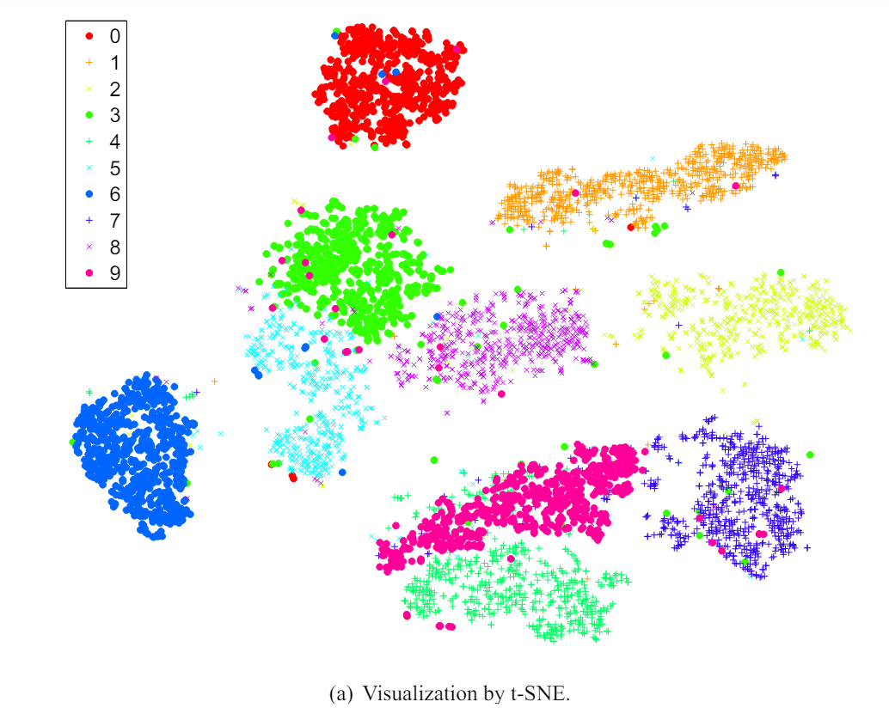</center> <br>

> t-SNE(t-Distributed Stochastic Neighbor Embedding)[[9]](#논문paper)은 고차원 데이터를 저차원(주로 2차원 또는 3차원) 공간에 시각화하여 데이터의 패턴과 구조를 쉽게 이해할 수 있도록 해주는 차원 축소 기법이다. 데이터 사이의 유사성을 보존하면서 고차원 공간에서의 군집 구조를 저차원 공간에서도 잘 드러내는 특징이 있다.

- CAM (Class Activation Map) Visualization

<center>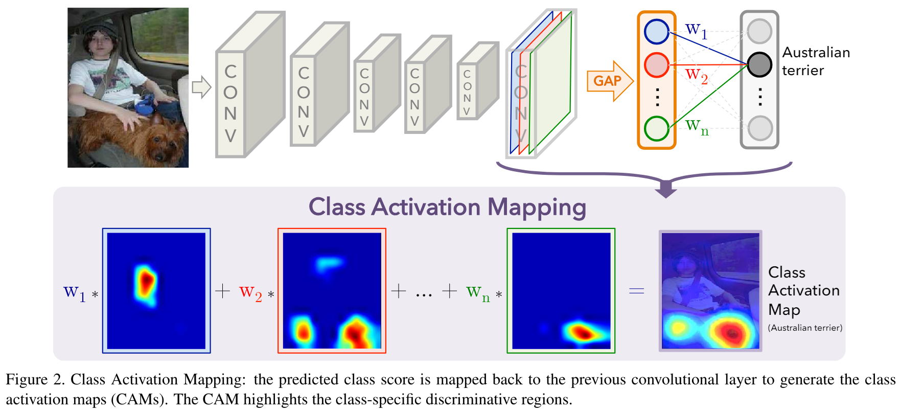</center> <br>

> CAM(Class Activation Mapping)[[10]](#논문paper) 시각화는 딥러닝 모델이 이미지의 어떤 부분을 사용하여 특정 클래스를 예측하는지 시각적으로 이해할 수 있게 해주는 기술이다. CAM은 주로 이미지 분류와 같은 컴퓨터 비전 작업에서 모델의 예측을 해석하고 디버깅하는 데 사용된다. 

# IV. Evaluation & Analysis
### Graphs, tables, any statistics (if any)

**다음은 세 개의 모델(AlexNet, VGG16, ResNet50)을 사용하여 epoch에 따른 validation과 test 세트의 정확도(Accuracy)와 손실(Loss)을 분석한 결과를 그래프로 나타낸 것이다.**

<p align="center">
    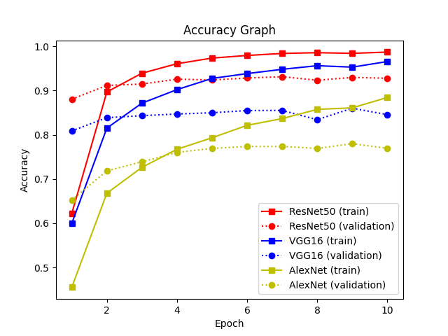
    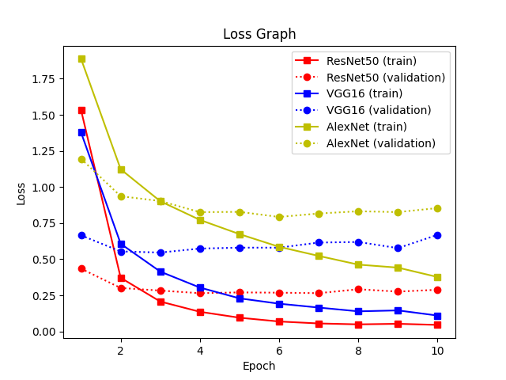
</p>

> 그래프에서 확인할 수 있듯이, ResNet50 모델은 모든 epoch에서 가장 높은 Accuracy 값을 기록했다. 이는 ResNet50이 다른 모델들에 비해 더 우수한 일반화 성능을 가지고 있음을 보여주었고, Loss 값에서도 ResNet50이 가장 낮은 값을 유지하였으며, 이는 모델의 예측이 실제 값과 얼마나 일치하는지를 보여주는 지표로, ResNet50이 다른 모델들보다 더 정확한 예측을 수행함을 의미한다.

**다음은 위에서 언급한 CNN Filter Visualiztion, T-SNE Feature Embedding Visulaization, CAM (Class Activation Map) Visualization  세가지 visualization 기법을 활용하여 우리 모델의 성능을 확인해본 결과이다.**

- CNN Filter Visualization

<center>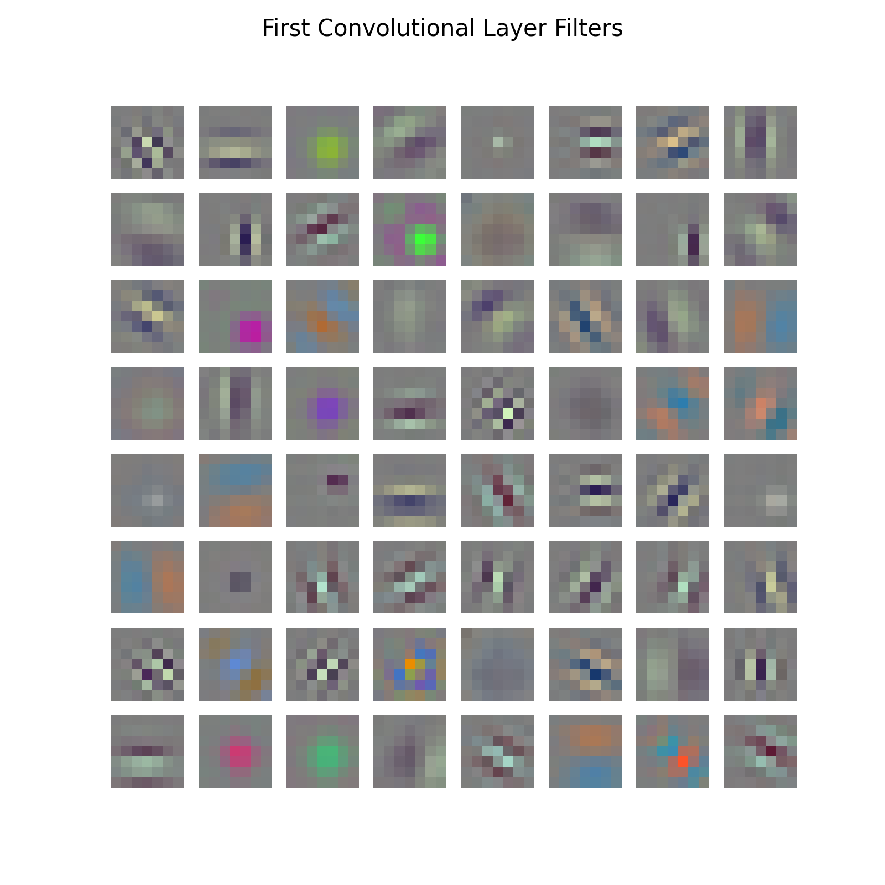</center> <br>

> CNN 필터 시각화를 통해 모델의 초기 필터가 이미지의 간단한 패턴과 선을 어떻게 파악하고 있는지를 알 수 있다. 시각화된 필터를 보면, 모델이 입력 이미지를 처리할 때 어떤 방식으로 되는지 볼 수 있다.

- T-SNE Feature Embedding Visulaization

<center>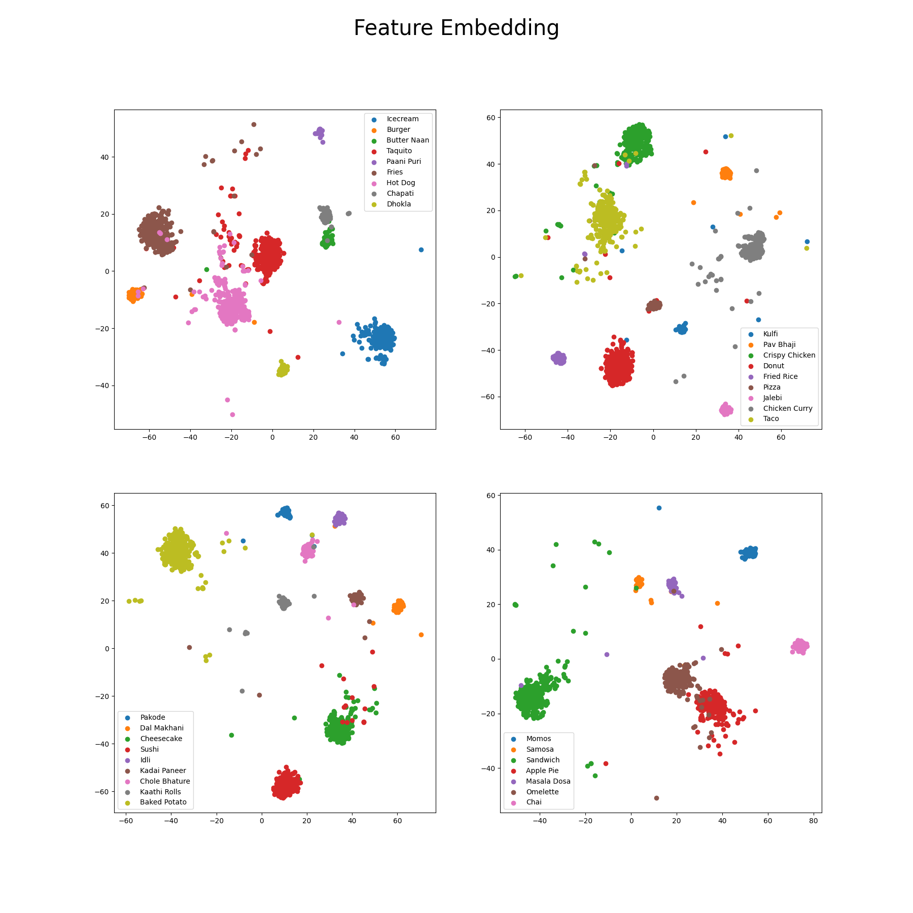</center> <br>

> 클래스를 시각화하기 위해 데이터 셋을 4개의 그래프로 나누어 표현했다. 약간의 오차는 존재하지만, 각 클래스 별로 고유의 군집을 형성하며 명확하게 구분되고 있다. 이를 통해 클래스 별 분포가 잘 이루어져 있음을 확인할 수 있다.

- CAM (Class Activation Map) Visualization

<center>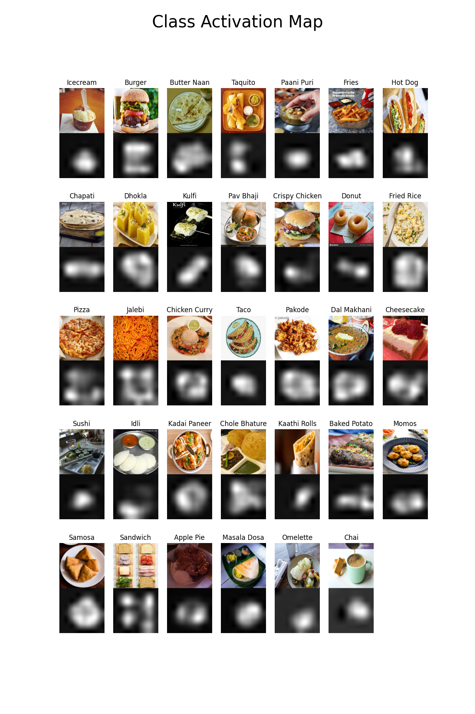</center> <br>

> 아래 그림은 각 클래스별 CAM(Class Activation Map)이다. 모델이 이미지의 음식 부분을 효과적으로 사용하여 특정 클래스로 잘 예측하고 있는 것을 알 수 있다. 예를 들어, 아이스크림을 보면 스푼은 인식하지 않고 정확히 아이스크림만 인식하는 것을 볼 수 있다.

**마지막으로 우리가 직접 찍은 사진(햄버거, 초밥, 치즈케이크)에 대해 ResNet50을 활용하여 분류해 보았다. Accuracy가 상당히 높은 것을 볼 수 있다.**

<center>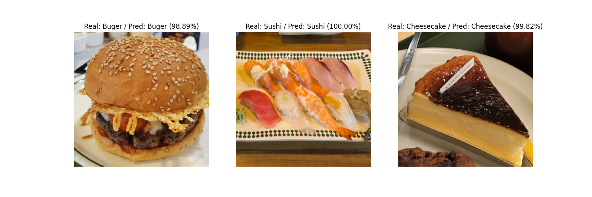</center> <br>

> 이를 통해 햄버거, 초밥, 치즈케이크와 같은 실용적인 이미지 분류 작업에서도 매우 유용하게 작동하였으며, 이는 향후 레스토랑 메뉴 추천 시스템이나 혹은 음식의 종류를 자동으로 인식하여 이에 대한 영양 성분 분석 등과 같은 더 복잡한 이미지 분류 작업에서 큰 도움이 되어 그러한 연구에 발판이 될 수 있을 것이다.

*AI가 뽑아냈던 신발모양 초밥 사진을 넣어보기도 했는데 98.85%의 정확도로 잘 분류하기도 했다.*

<center>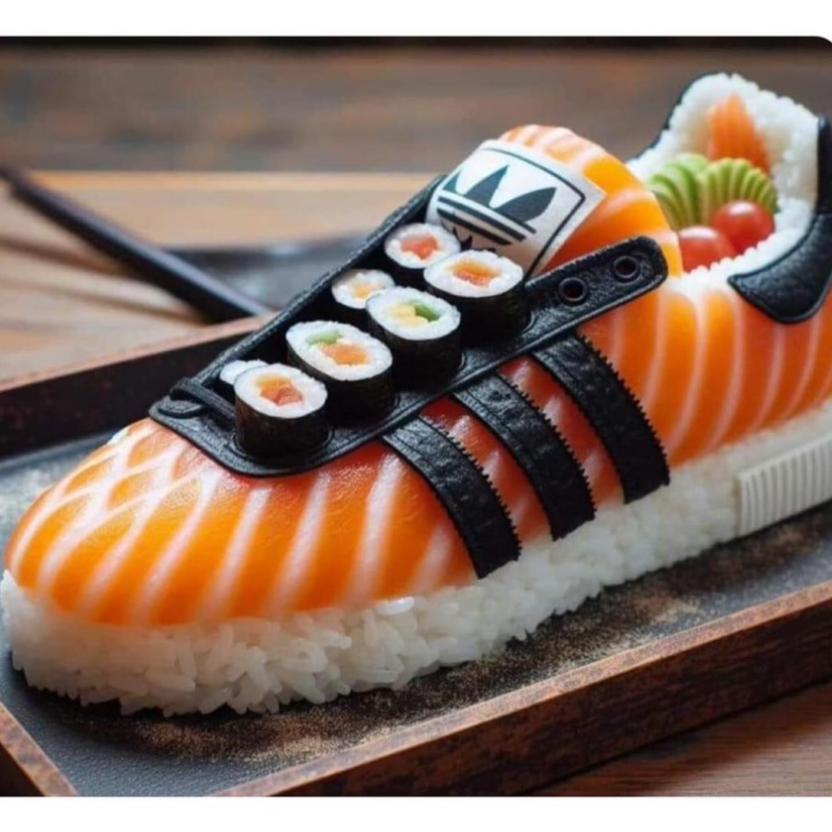</center> <br>

# V. Conclusion: Discussion
우리 프로젝트는 현대인의 건강관리와 식단 관리에 대한 관심이 증가함에 따라, 이러한 요구를 충족시킬 수 있는 인공지능 시스템을 구축하고자 시작되었다. SNS의 발달과 코로나19 팬데믹은 운동과 건강에 대한 관심을 더욱 증대시켰으며, 그 결과 식단 관리에 대한 수요가 급증했으며 이에 발맞추어, 우리는 음식 이미지 분류를 통해 식단 관리에 실질적인 도움을 줄 수 있는 딥러닝 시스템을 개발하고자 했다.

프로젝트 진행 과정에서 우리는 ResNet, AlexNet, VGG와 같은 다양한 딥러닝 모델을 활용하여 성능을 비교해보았다. 그 결과, ResNet 모델이 가장 높은 정확도를 보여주었다. 또한 여러 시각화 기법을 통해 모델의 성능과 내부 작동 방식을 심도 있게 분석할 수 있었다. 특히 CNN 필터 시각화, T-SNE 임베딩, CAM 분석을 통해 모델이 음식 이미지를 어떻게 인식하고 분류하는지 시각적으로 이해할 수 있었다.

우리의 모델은 단순한 식단 관리에 그치지 않고, 레스토랑 추천, 건강 관리, 요리 레시피 추천 등 다양한 분야에서도 활용 가능성을 보여주었다. 이는 인공지능 기술이 실제 생활에서 다양한 방식으로 유용하게 적용될 수 있음을 증명하는 결과다.

주요 성과 및 실생활 적용

1. 모델 성능: ResNet이 가장 우수한 성능을 보였으며, 이를 통해 정확하고 신뢰성 있는 음식 이미지 분류가 가능함을 입증했다.

2. 시각화 기법: 다양한 시각화 기법을 통해 모델의 내부 작동 방식을 이해하고, 분류에 중요한 역할을 하는 요소들을 파악했다.

3. 실생활 적용: 우리가 직접 찍은 사진을 모델에 넣어서 우리의 모델이 실제로 식단 관리 외에도 레스토랑 추천, 건강 관리, 요리 레시피 추천 등 여러 분야에서 활용될 수 있는 가능성을 보여주었다.

향후에는 더 다양한 음식 이미지를 포함한 대규모 데이터셋을 활용하여 모델의 일반화 능력을 향상시키고, 최신 딥러닝 기법을 적용하여 성능을 더욱 개선해 볼 수 있을 것이다. 또한, 실제 어플리케이션에 모델을 적용하여 실시간 음식 이미지 분류 시스템을 구축하고, 사용자 피드백을 통해 시스템을 지속적으로 개선해 나갈 수 있을 것이다.

이번 프로젝트를 통해 우리는 인공지능을 활용한 음식 이미지 분류의 가능성을 파악할 수 있었으며, 이를 바탕으로 실생활에 유용하게 적용될 수 있는 모델 개발에 한 걸음 더 나아갈 수 있었다. 우리의 프로젝트는 인공지능 기술이 일상생활에서 다양한 문제를 해결하는 데 중요한 도구가 될 수 있음을 보여주었다.

# VI. Related Works & References
### Tools, libraries, blogs, or any documentation that you have used to to this project.
**툴(Tool)**: Python

**라이브러리(Library)**: **PyTorch**(torch, torchvision)

### 블로그(Blog)
> \[1\] [Kaggle Dataset](https://www.kaggle.com/datasets/harishkumardatalab/food-image-classification-dataset)

> \[2\] [Wikidocs page](https://wikidocs.net/164796)

> \[3\] [About CNN Model page](https://velog.io/@kgh732/%EB%B6%80%EC%8A%A4%ED%8A%B8%EC%BA%A0%ED%94%84-AI-Tech-U-stage.-3-3)

> \[4\] [About Data Augmentation](https://pranjal-ostwal.medium.com/data-augmentation-for-computer-vision-b88b818b6010)

### 논문(Paper)
> \[5\] [Deep Residual Learning for Image Recognition](https://arxiv.org/pdf/1512.03385)

> \[6\] [ImageNet Classification with Deep Convolutional Neural Networks](https://proceedings.neurips.cc/paper_files/paper/2012/file/c399862d3b9d6b76c8436e924a68c45b-Paper.pdf)

> \[7\] [Very Deep Convolutional Networks for Large-Scale Image Recognition](https://arxiv.org/pdf/1409.1556)

> \[8\] [Visualizing and Understanding Convolutional Networks](https://arxiv.org/pdf/1311.2901)

> \[9\] [Visualizing Data using t-SNE](https://www.jmlr.org/papers/volume9/vandermaaten08a/vandermaaten08a.pdf)

> \[10\] [Learning Deep Features for Discriminative Localization](https://arxiv.org/pdf/1512.04150)